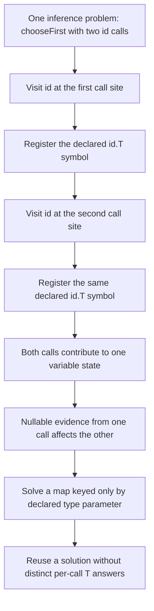
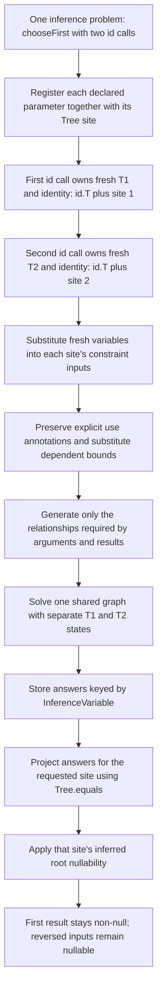

# Give each generic call its own inference identity

## Scope and reading guide

This document describes [patch 01](0001-call-specific-inference-variables.md) against master `b8e88803`.
The repaired base includes both 01 and 02; full-type results and lifecycle changes belong to [the 02 diagrams](DIAGRAM-0002-INFERENCE-AND-LIFECYCLE.md), not this stage.
Patch 03 delivers both stages together and needs no separate architectural diagram.

NullAway is a static analyzer: it checks source without executing it, including whether inferred generic type arguments permit null.
For `chooseFirst(id(nonNull), id(nullable))`, the return value comes from the first argument, so the second call's nullable input must not make the first call's inferred `T` nullable.
The diagrams show inference identity and information flow, not runtime execution.

## Before 01: Identify variables by declaration alone

The collision is between two uses of the same declaration, not between every variable named `T`.
The existing solver already relates enclosing calls, arguments, results, and generic references; the missing distinction is **which use** of a declaration owns an inferred argument.

## After 01: Identify variables by declaration and site

## Implementation anchors

Implementation anchors are under `nullaway/src/main/java/com/uber/nullaway/generics/`; the patch payload identifies what belongs specifically to 01.

- `ConstraintSolver.java`: `InferenceVariable(Element typeVariable, Tree site)` records ownership. Sites include generic invocations, diamond constructors, and generic method references.
- `ConstraintSolverImpl.java`: `registerInferenceVariables` creates fresh symbols, reuses them when the same site is registered again in the solver, and substitutes bounds after creating all variables so recursive/dependent bounds can refer to fresh peers.
- `TypeSubstitutionUtils.java`: `substituteTypeVariables` finds occurrences by symbol and preserves explicit occurrence-level nullness through substitution.
- `GenericsChecks.java`: invocation signatures and constructed types use fresh variables; reference constraints freshen only the referenced-method side, leaving functional-interface variables fixed when appropriate.
- `GenericsChecks.java`: 01's `typeVarNullabilityForSite` projects a shared scalar solution; 02 changes this to the full-type `inferredTypesForSite` seen in the final implementation.

## What changes, and what does not

Fresh symbols separate call identity **within a shared solver**; they do not sever valid constraints between nested calls or allocate one solver per participating site.
Variables not registered in that inference problem remain fixed, including enclosing generic parameters.
Explicit annotations on occurrences still override inferred root nullness, and modeled upper-bound nullability is preserved when fresh symbols would otherwise lose the declaration-indexed model.
Stage 01 retains the existing cache behavior and nested-substitution repair fallback; it still solves scalar root nullability rather than complete nested type evidence.

`GenericMethodTests.issue1291` covers repeated calls, reversed inputs, deeper nesting, and a non-local target; `issue1291RepeatedDiamond` covers repeated diamond constructors and reversed inputs.
The patch's validation notes record passing `:nullaway:test` and `:nullaway:buildWithNullAway`; this documentation task ran no Gradle commands.
