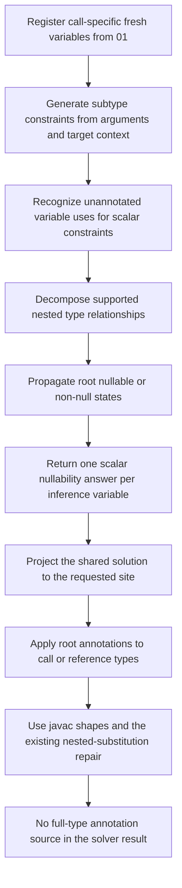
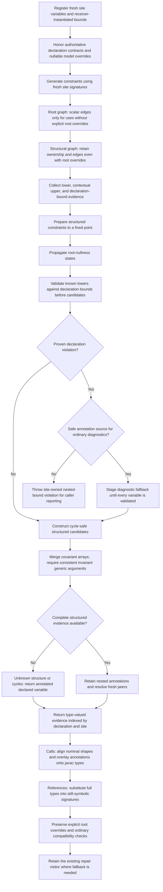
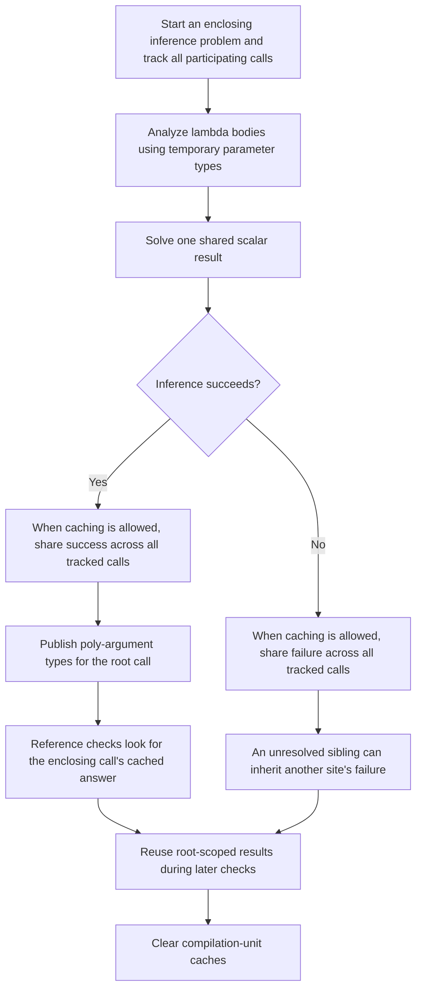
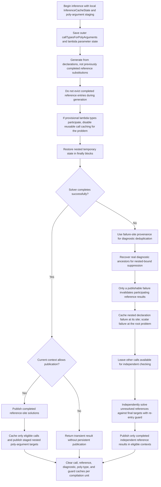

# Preserve nested inference evidence and completed site results

## Scope and reading guide

These diagrams compare the state **after 01 but before 02** with [the actual repaired patch 02](0002-reconcile-full-inferred-types.md).
[Patch 03](0003-complete-solution.md) packages 01 and 02 as an alternative delivery, not a third architectural stage.
The additional array/dataflow stage is documented separately in [the 004 diagrams](DIAGRAM-0004-ARRAY-DATAFLOW.md); the quality patch changes readability, not architecture.

NullAway checks possible null misuse without running code.
Generic inference chooses arguments for parameters such as `T`; NullAway needs both root nullness and facts inside generic arguments, array components, enclosing types, and supported wildcard bounds.
For example, a non-null `Box<@Nullable String>` may contain null even though the box itself cannot be null.

## Inference before 02: Return scalar nullability

Before 02, decomposition can constrain variables in nested positions, but the result map cannot carry a structured replacement such as `R = Box<@Nullable String>`.
An explicitly annotated variable occurrence is excluded from scalar inference; 02 adds structural ownership independent of that root eligibility.

## Inference after 02: Separate root and structural graphs

The root and structural nodes depict two views of the **same inference variables**, not unrelated solvers; candidate/fallback nodes describe alternatives within result construction, not mandatory transformations of every result.

### Declaration validation is not candidate construction

`ConstraintSolverImpl.solve` prepares structural constraints, propagates scalar states, validates declaration bounds, and only then constructs final inferred types.
`validateDeclarationBounds` checks known lower evidence even when a cycle or incompatible candidate merge prevents full inference; a concrete violation is not erased by an unknown sibling position.
Diagnostic fallback types are collected temporarily and installed only after every variable has been validated, so a fallback for one variable cannot hide evidence needed to validate another.
Representable violations preserve ordinary argument/reference diagnostics; otherwise `NestedUpperBoundViolationException` carries the declaration, site, lower bound, and upper bound for `GenericsChecks` to report.
Wildcard containment respects the wildcard-generics feature gate and uses recursion guards; unmarked declarations are not promoted into authoritative nullness evidence.

### Root annotations do not erase structural contracts

`inferenceVariableForUse` excludes explicit `@Nullable`/`@NonNull` root occurrences from scalar inference.
`inferenceVariableForStructure` retains their registered symbol ownership, and `structuralSubtypes`/`structuralSupertypes` preserve nested evidence separately from scalar `subtypes`/`supertypes`.
Thus an explicit annotation may fix the nullness of a `T` occurrence without discarding constraints on the contents of the inferred `T`.

### Calls and references consume full results differently

`TypeSubstitutionUtils.updateTypeWithInferredNullability` overlays inferred nested annotations onto javac's already-instantiated call type, preserving its nominal shape and explicit root annotations.
`overlayInferredTypeAnnotations` recursively aligns class shapes via `asSuper`, checks argument counts, and avoids positional overlay onto unmatched classes, including inside arrays.
`substituteInferredTypesForGenericMethodReference` instead substitutes complete inferred types into a still-symbolic referenced signature: replacing only the annotation on `T` would lose its nested structure.
Annotated declared-variable fallback results remain symbolic; they do not become their upper bounds as replacement types.
Contextual incompatibilities can retain lower-bound annotation evidence so established ordinary checks report at their usual locations.

## Lifecycle before 02: Broad result reuse

This comparison is with stage 01, not with the archived rejected version of 02.
The pre-02 path already has cache eligibility checks and compilation-unit cleanup; 02 refines participating-call eligibility, completed reference publication, failure ownership, and nested-context restoration.

## Lifecycle after 02: Stage work, then publish completed results

### Transactional publication and provenance

Here, **transactional** means separating temporary constraint-generation work from persistent publication; it does not imply a database transaction or atomic concurrency guarantee.
`InferenceCacheState.recordCall` permanently disables reusable call caching for the shared problem once provisional lambda parameters participate, since all its variables may be connected.
Completed reference results and staged poly-argument targets can still be published after the enclosing problem finishes, when `okToCacheInferenceResult` permits publication; that gate rejects dataflow and currently active provisional-lambda contexts.
`callTypesForPolyArguments` and `lambdaParameterTypesForInference` are restored in `finally` blocks when inference nests, fails, or re-enters.
A nested declaration violation caches failure only at the completed failing site, while a scalar contradiction caches the root problem; neither marks every sibling as failed.
The scalar exception's owning inference site deduplicates warnings separately from root-problem caching, and nested-bound reporting uses `stateForInferenceDiagnostic` to recover actual suppression ancestors from the compilation unit.
`inferGenericMethodReferenceIndependently` guards re-entry and checks unresolved siblings without publishing or invalidating call results.
`clearCache` clears persistent results, diagnostic provenance sets, and re-entry/repair guards after each compilation unit.

## Evidence and limits

- Permanent tests in `GenericMethodTests`, `GenericMethodLambdaOrMethodRefArgTests`, and `GenericInferenceErrorReportingTests` cover nested nullness, receiver bounds, arrays, recursive/wildcard declarations, explicit root overrides, structured references, nested poly-argument publication, failed siblings, exact diagnostic counts, and local suppression.
- [REPAIR-REPORT.md](REPAIR-REPORT.md) records passing full `:nullaway:test` and `:nullaway:buildWithNullAway` runs: 62 suites, 1,159 tests, zero failures/errors, and 21 skipped. This documentation task ran no Gradle commands.
- The existing `NestedTypeVarSubstitutionRepairVisitor` remains a fallback; these changes do not replace all Java generic-shape inference.
- `knownLimitationMixedInvariantLowerBoundsReportFalsePositiveIncompatibilities` characterizes a pre-existing mixed-invariant/common-supertype false positive, rather than proving that inference case correct.
- Direct array-element dereference propagation is added separately by 004. Nullable library-model overrides are handled, but no dedicated external custom-model integration test was added.
- Passing finite tests and reviews does not establish the absence of every false positive or false negative.
