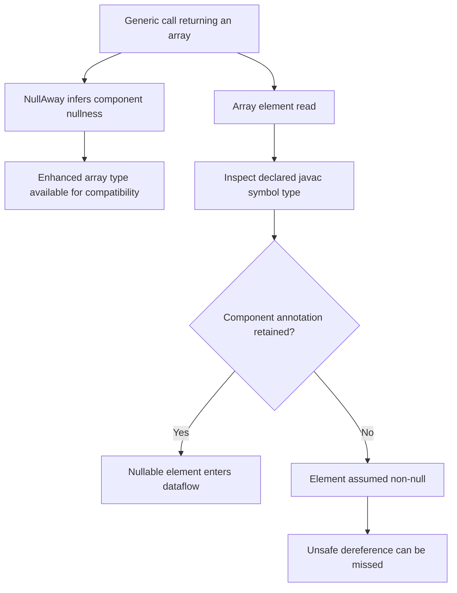
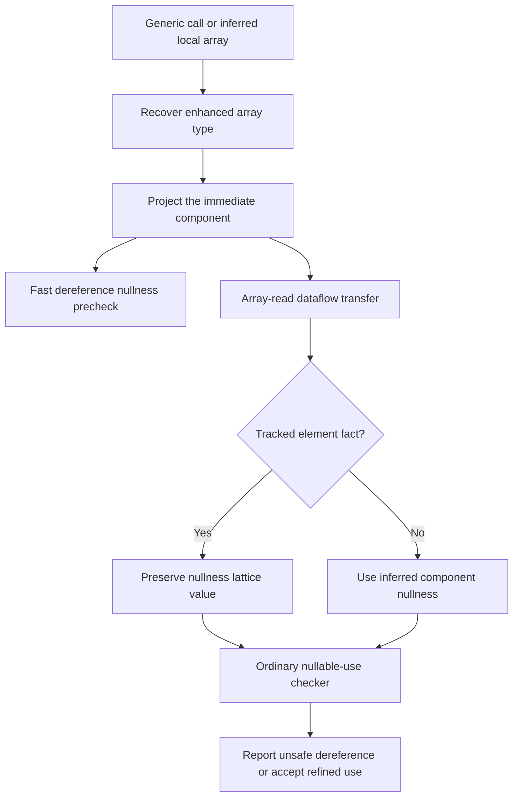
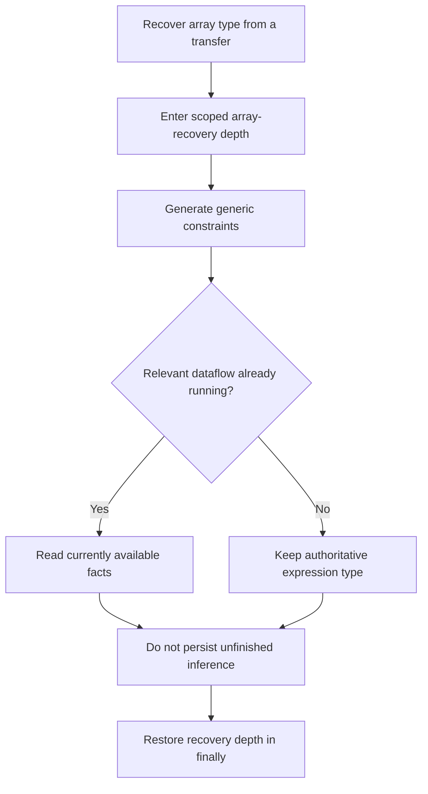
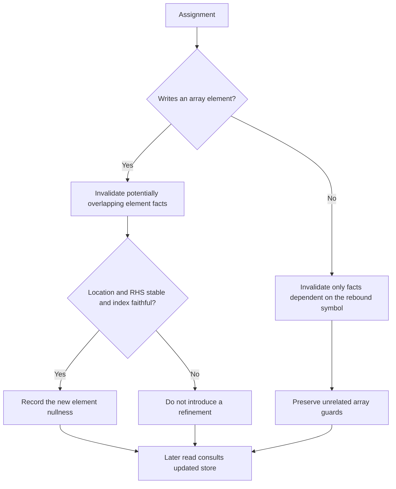

# Patch 004: Inferred array types reach element reads

This diagram covers the real incremental Patch 004, not the proposed repair-removal work. Apply it after 01 + 02 or after combined 03.

## Before

The solver could preserve nullable array components for parameter compatibility, while an element read still inspected javac's symbol type. Direct call expressions have no array-variable symbol; `var` symbols can omit the inferred component annotation.

## After

Both the fast dereference precheck and the dataflow transfer ask for the enhanced array type. Each array access projects one component dimension. Existing access-path facts refine the result; definite-null facts remain definite-null instead of becoming non-null.

## Analysis re-entry

The no-restart rule is scoped to array recovery; ordinary lambda inference retains its previous refinement behavior.

## Assignment precision

Instance-field indices are not used to create assignment refinements because the existing representation omits their receiver identity. Method/constructor calls retain the existing call-effect policy and library-model postconditions; this patch does not claim a complete alias or call-effect analysis.
