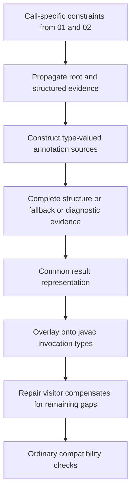
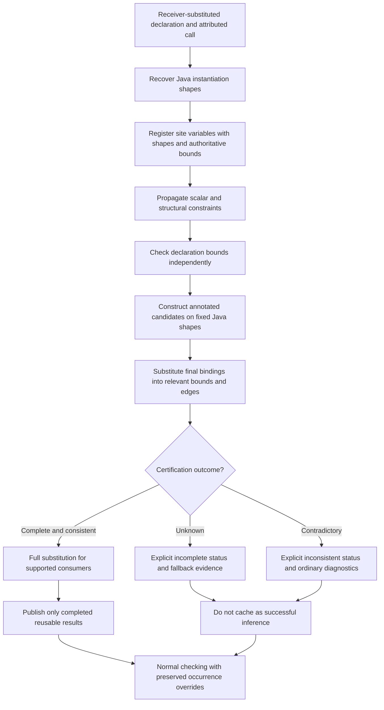
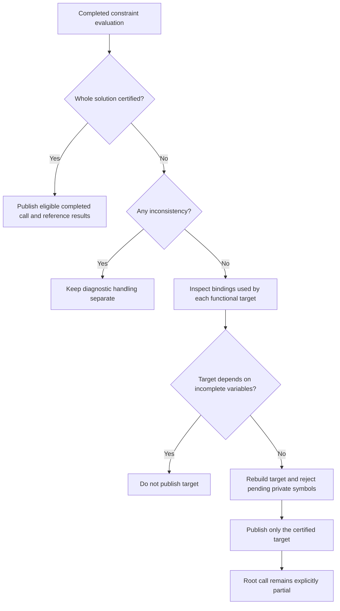
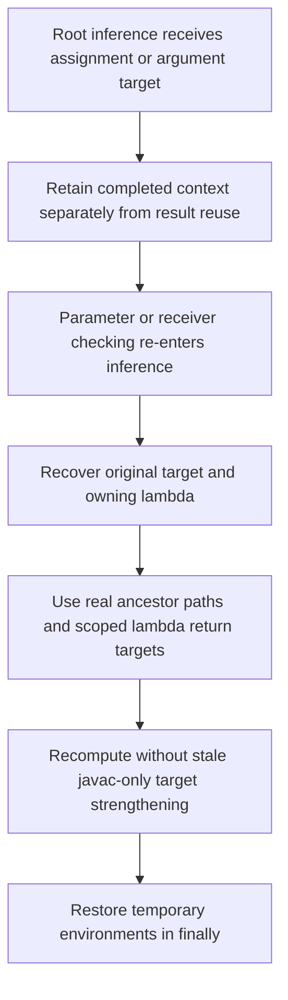

# Patch 005: Recover shapes and certify results

## Before 005

Type-valued results could represent complete evidence, scalar fallback, or a diagnostic source without a separate status. Ordinary invocation consumers used overlays and the repair visitor.

## After 005

Scalar contradictions still use established exception/warning handling. Collection immutability is not a claim that contained javac types are deeply immutable.

## Target publication with unused variables

This preserves a valid lambda target when an unrelated unused recursive parameter remains opaque; it does not promote the incomplete root solution to success.

## Stable context during re-entry

Direct compiler-backed tests inspect the result map and certification sets, including enclosing-type constraints, fixed symbols, late evidence, model precedence, source isolation, and contradictions. Unsupported cases remain explicitly incomplete; the diagram does not claim broader Java LUB inference.
