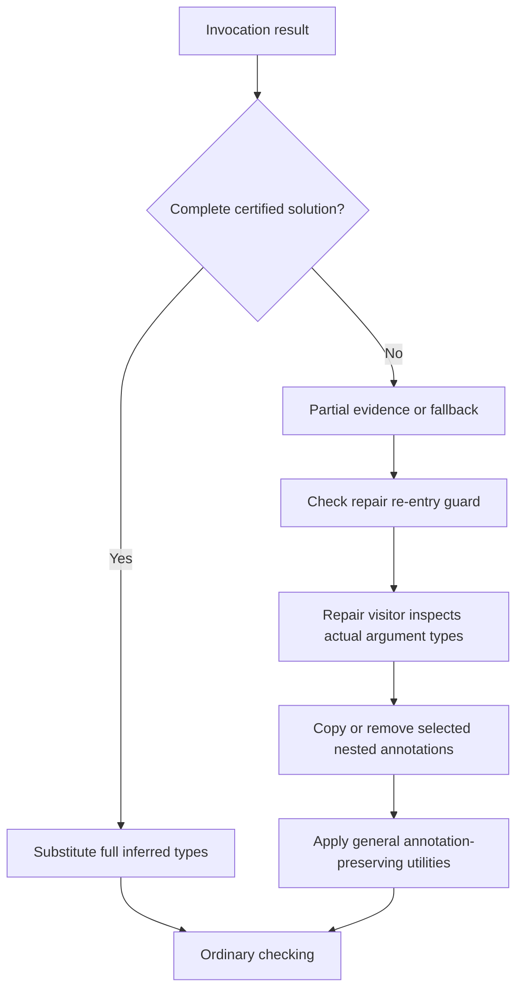
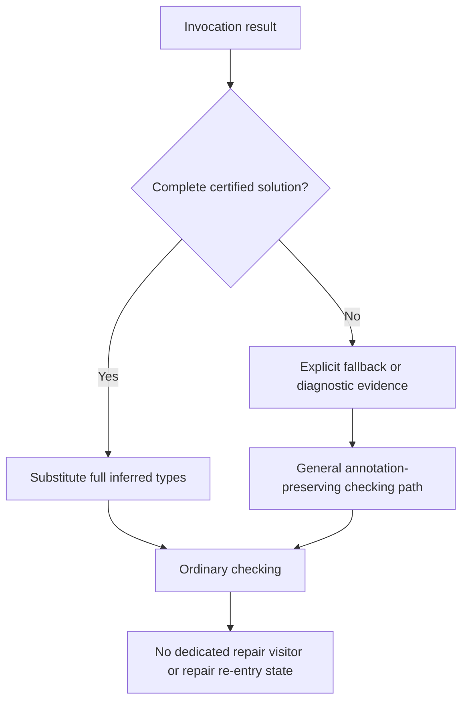
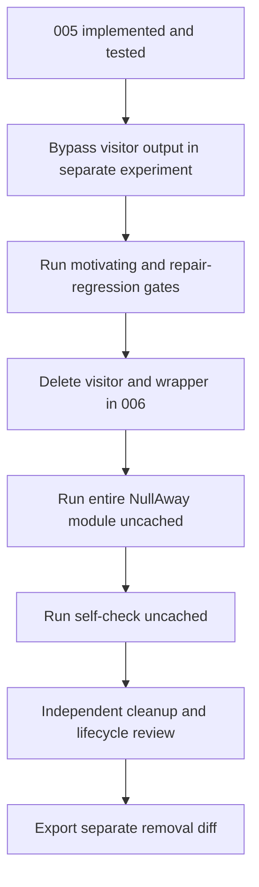

# Patch 006: Remove the obsolete repair lifecycle

## Before 006, with 005 present

Complete solutions already take the full-substitution path. The old visitor still exists in the partial invocation path, with its own wrapper and re-entry tracking.

## After 006

## Cleanup gate

The valid #1455 case that failed before 005 now passes without the visitor. General metadata-copy, member/supertype, explicit-annotation, and fallback utilities remain; they are not the obsolete visitor being removed. 006 changes test comments and one method name, but not expected diagnostics.
