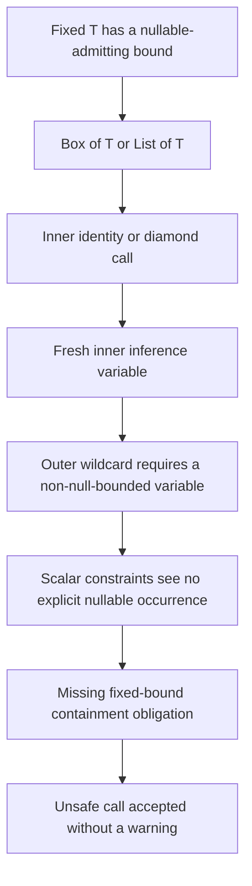
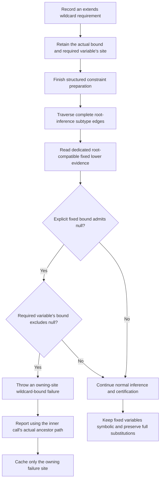
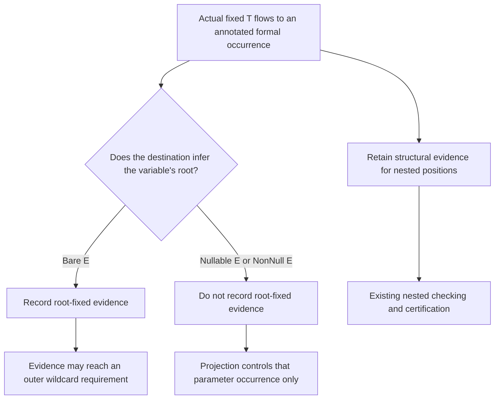

# Patch 007: deferred wildcard obligations

007 applies after 006. These diagrams show the missing direct/nested contract and its general replacement, not the separate scalar-marker implementation in open PR #1834.

## Before 007

The same missing obligation affects direct calls on this baseline; full-type result preservation alone does not establish it.

## After 007

Requirements are recorded only for eligible non-null-bounded inference variables, so the second decision summarizes the registration-time gate rather than an extra solve-time branch. The obligation is checked before successful result publication; it does not mutate a fixed `T` into `@Nullable T`.

## Why structural and root evidence must stay separate

The review-discovered `empty(@Nullable E)` false positive showed why reading ordinary structural lower bounds was insufficient: permission for a nullable input does not make an independent empty result nullable. Dedicated root evidence fixes that distinction without discarding nested constraints.

## Acceptance evidence

Eleven source-level regressions and three direct solver methods cover the reported four diagnostics, projected source/formal controls, nullable-accepting and non-null-bound APIs, bound chains, intersections, markedness, method-owner models, graph ordering/repeated solves, and owning-site/sibling/suppression reporting. Both patch-stack export alternatives reproduce all fifteen tested changed paths byte-for-byte; the full uncached suite and self-check pass. See [ISSUE-1947-VALIDATION.md](ISSUE-1947-VALIDATION.md) for results and limitations.
