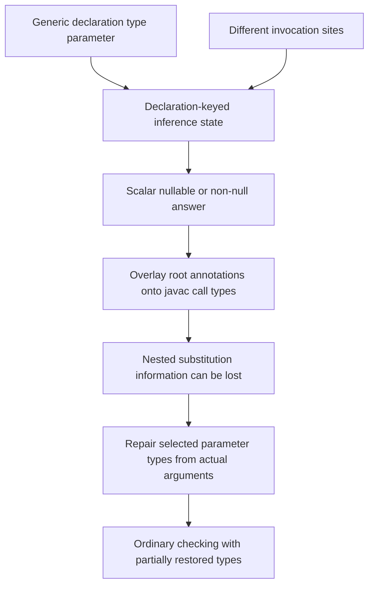
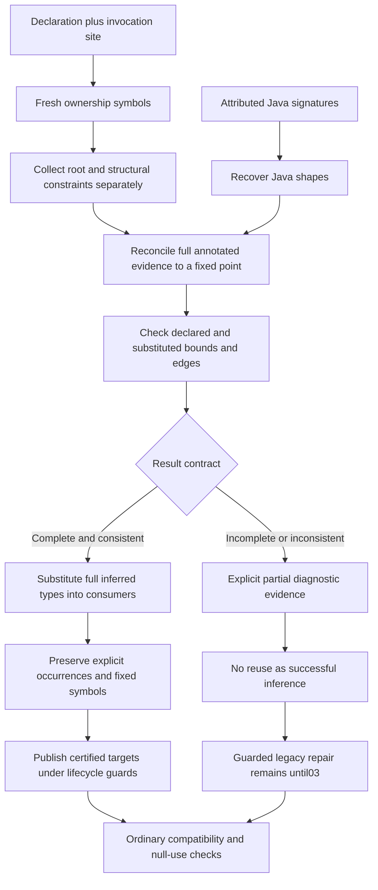
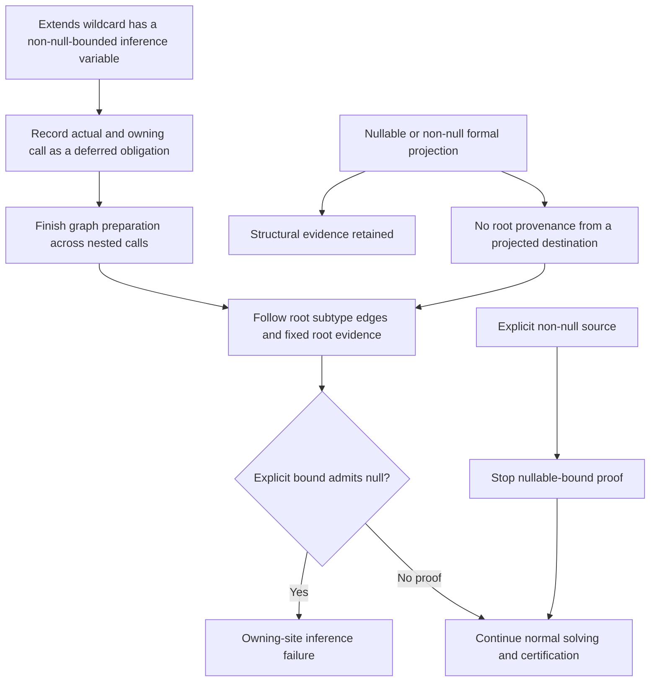

# Patch 01: final call-specific full-type inference

This combines the final inference design rather than presenting its discarded intermediate APIs. Array expression/dataflow consumers arrive in 02; the existing fallback repair remains until 03.

## Before

## After

COMPLETE describes the represented inference problem; it does not disable ordinary argument checking. Result maps have immutable collection snapshots, not a guarantee that every contained compiler type graph is deeply immutable.

## Fixed-bound wildcard obligations

A fixed variable T that permits nullable instantiations stays symbolic. The restrictive wildcard requirement is checked without converting T globally to nullable-T, so nullable-accepting APIs and same-T operations remain valid. Raw/capture/unsupported paths retain explicit limitations rather than gaining blanket success from the absence of this specialized exception.
