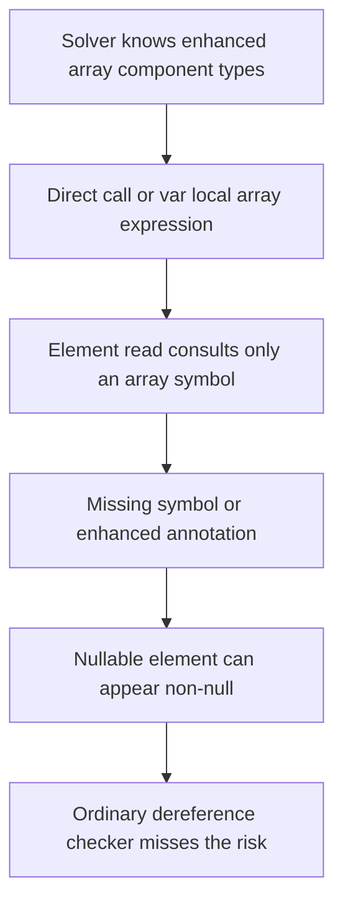
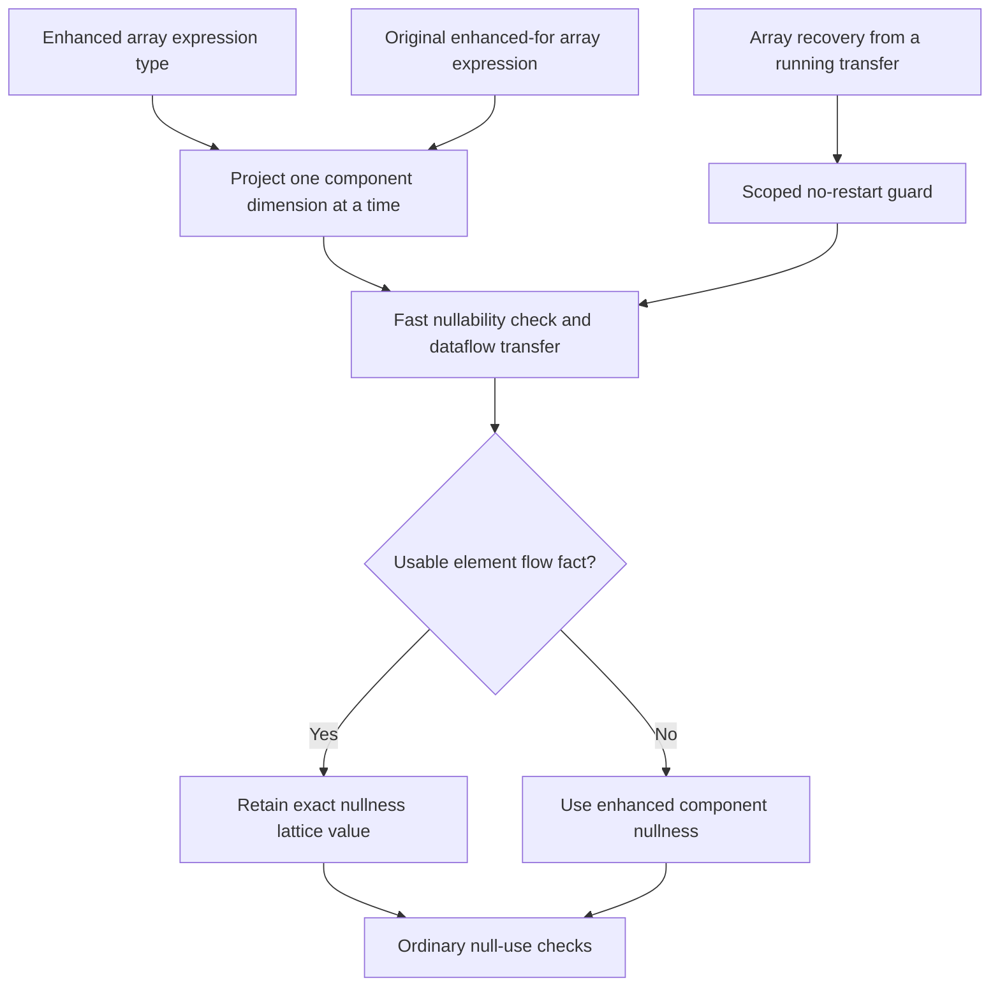
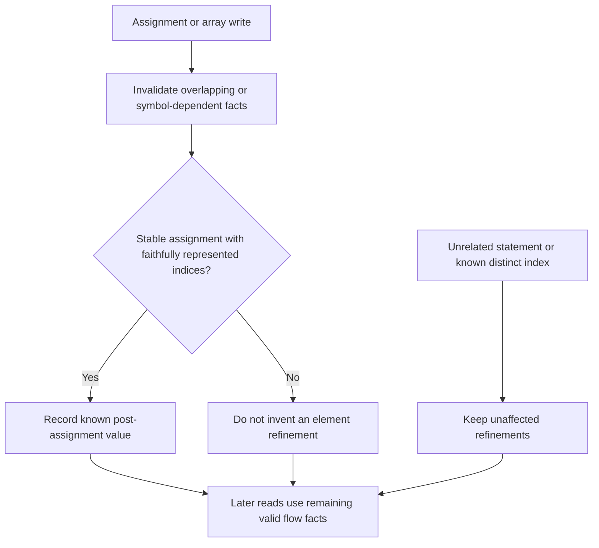

# Patch 02: enhanced array types reach ordinary flow checks

01 can infer and certify nested array nullness. This patch connects that result to element-read consumers without changing the solver API.

## Before

## After

## Keep sound invalidation and useful refinement together

Different array roots may alias. Instance-field index receivers are not faithfully represented by the existing index abstraction, so they cannot justify assignment refinement. This is bounded assignment invalidation, not complete alias/call-effect analysis; method calls retain the existing refinement policy and library-model postconditions remain effective.
