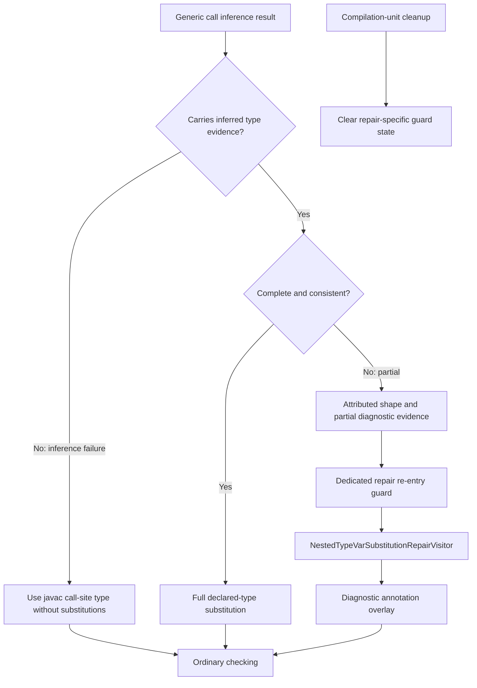
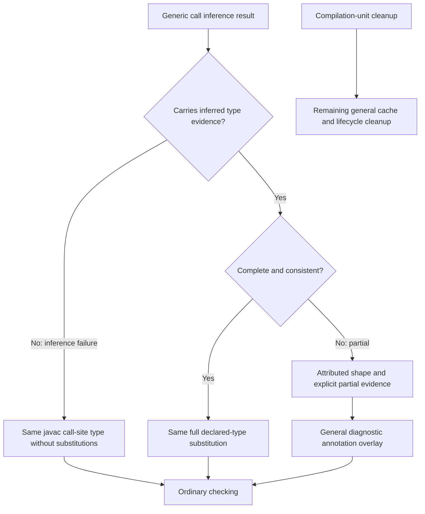

# Patch 03: remove the old repair only after replacement validation

This is the final review unit. It removes the old visitor, its wrapper, dedicated guard and cleanup entry, without changing the complete inference API from 01.

## Before deletion: after 01 and 02

## After deletion

Partial results do not become successful simply because the repair is gone. Inference failure is distinct from partial evidence and does not enter the annotation-overlay path. General metadata-copying, substitution, wildcard/capture, and diagnostic utilities remain needed by other paths.

The valid issue1455 supplier case, motivating generic cases, and modeled-return regression pass with the visitor physically deleted. Only repair-specific wording and one test method name change in this patch; expected diagnostics do not.
